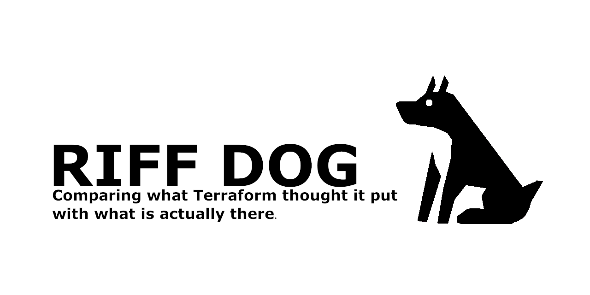
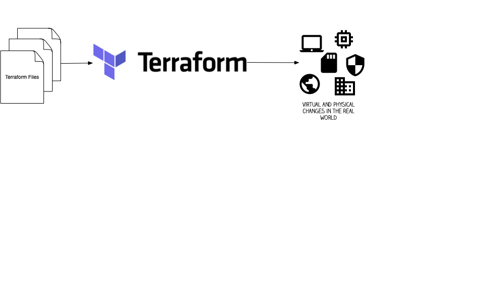
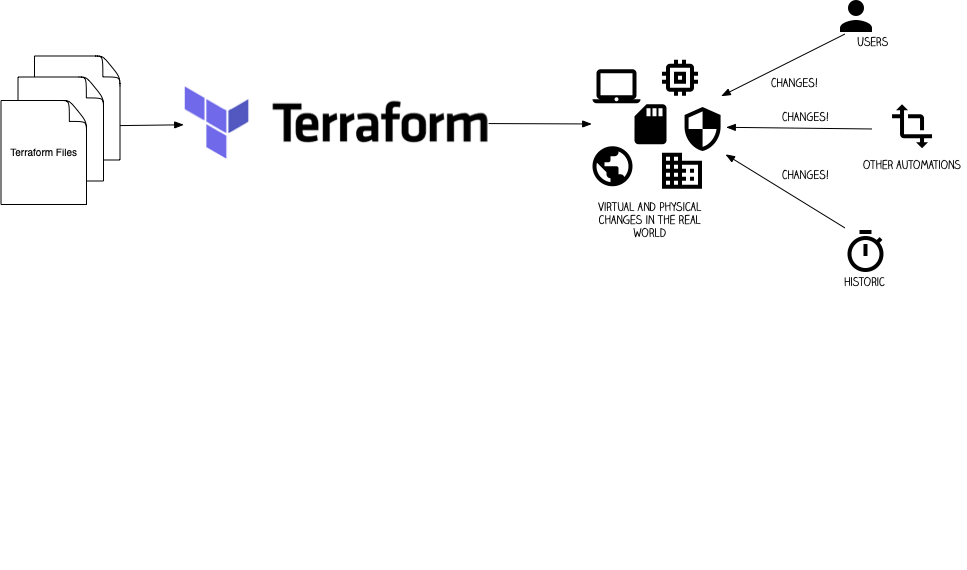
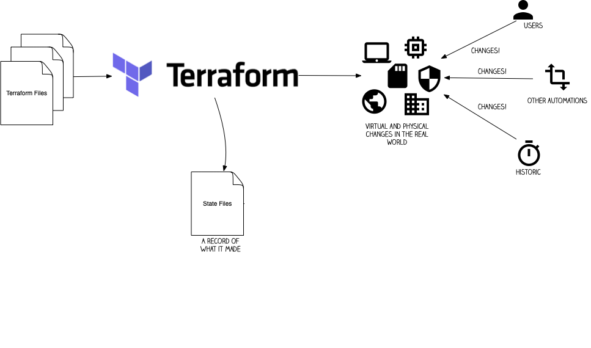
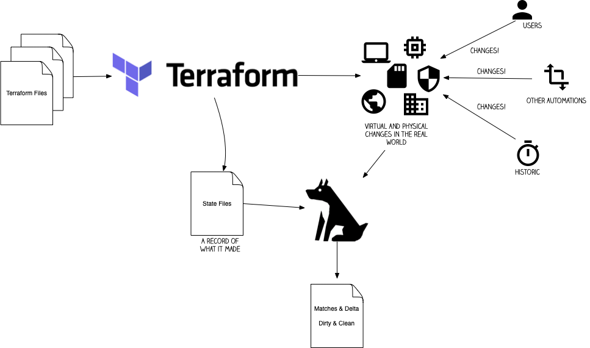

---

---

---

> Even if your process is so awesome, and your environments so locked down, how are you sure?

---

---

---

# Why doesn't terraform do this?
# Isn't this just terraform import?

---

# Riffdog Demo

---

# The Riffdog Project

- https://github.com/riffdog / https://riffdog.org/
- Multiple sub-repos broken down in the same way as Terraform providers - install what you need!
- MIT licensed - go use it, expand it!
- Core team accepting patch! Everything peer reviewed!

